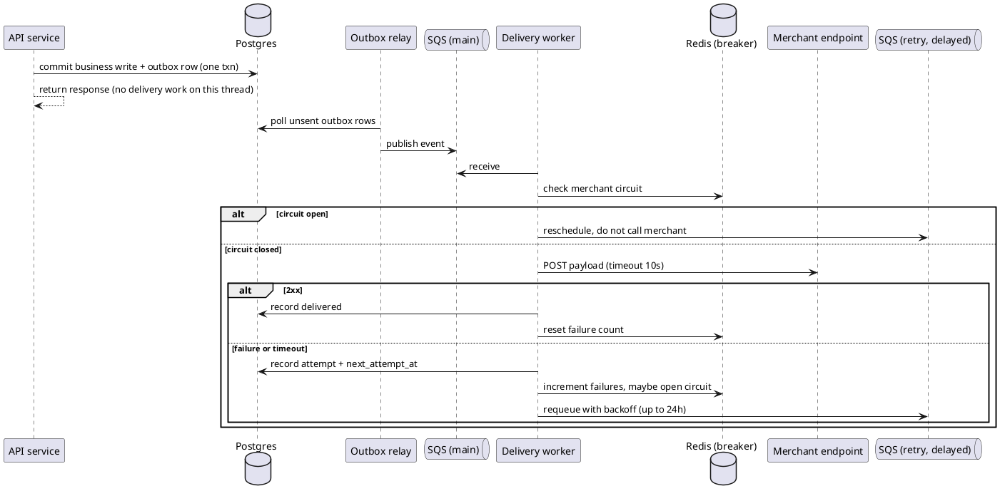

# Asynchronous webhook delivery

*Author: platform team. Status: draft, for review. Sign-off needed from: platform lead, ops, product (for the documented ordering and duplicate behavior).*

**Summary.** Move webhook delivery off the API request thread into a dedicated delivery service fed by a transactional outbox and SQS Standard, with per-merchant circuit breaking and a durable delivery record. That decouples API latency from merchant endpoints and gets delivery to 99.9% by retrying for 24 hours instead of 3 seconds.

## Context and problem

`api/src/webhooks/dispatcher.py` delivers webhooks inline: after the transaction commits, the same request thread POSTs to every subscribed endpoint, retries 3 times with a 1-second sleep, then drops the event. No record survives beyond a log line.

So merchants lose events - 2.5% of deliveries exhaust retries and are dropped silently, about 100k a day. A merchant down for four seconds loses everything sent in that window with no way to find out what they missed. Missed webhooks are our top support category at ~30% of tickets.

And merchant endpoints control our API latency. A slow endpoint holds a request thread through 3 seconds of sleep plus the POSTs. When a large merchant slowed down, API p99 went from 180ms to 8s - that's INC-4312, thread-pool exhaustion and 40 minutes of elevated 5xx on Black Friday from one merchant's endpoint.

Scale the design has to survive: 4M events/day (~46/sec), daily peak ~120/sec, Black Friday ~400/sec. Volume has doubled two years running, so call it ~800/sec next Black Friday.

Raising retries isn't the fix. We tried in 2023: ~1% better delivery, and it produced the coupling that caused INC-4312.

## Goals and non-goals

Goals: delivery success >= 99.9% over 7 days for endpoints that are up; API latency independent of merchant endpoints, including one hanging for 30s; a durable per-event delivery record; no change to the public API contract.

Non-goals: a merchant-facing delivery log (product marked it nice-to-have), merchant-initiated replay, strict per-merchant ordering, and any change to the event schema or subscription model.

## Constraints and assumptions

Constraints: 3 engineers for a quarter alongside on-call. AWS shop - ops runs Postgres, Redis, ECS, and nobody here has run Kafka. Payloads carry customer PII, so anything storing them honors 30-day retention and stays in the existing AWS account (this is what killed the third-party proposal). Public API contract is frozen this quarter; ordering and duplicate behavior can change if documented.

Assumptions, each a bet worth checking:

- Merchant failures are mostly transient. 99.9% is only reachable if a 24-hour window catches most of the current 2.5%. If much of that 2.5% is permanently dead endpoints, we hit a ceiling below 99.9% however we retry.
- Payloads are small enough to store for 30 days. Size isn't tracked, so this is genuinely unknown.
- Delivery to a healthy endpoint averages under ~300ms. This sets worker concurrency; higher means more workers, not a different design.

## Options considered

**A: outbox in Postgres, SQS Standard, delivery service on ECS.** The API writes the event to an `outbox` table in the business transaction. A relay publishes unsent rows to SQS. Workers consume, POST, record the result, and requeue failures with backoff to 24 hours; a per-merchant breaker in Redis stops us spending workers on an endpoint that's down. Most moving parts of the options that work, and at-least-once means documented duplicates - but every component is something ops already runs. Most of a quarter.

**B: Postgres-only queue.** Same outbox, workers poll it with `SKIP LOCKED`, no SQS. Fewer parts, decouples latency just as well, maybe two thirds the effort. Cost is that Postgres becomes the queue at 400/sec plus retries: dead tuples, vacuum pressure, and index bloat on the database serving the API.

**C: SQS FIFO, `MessageGroupId` = merchant.** Real per-merchant ordering, same effort as A. But head-of-line blocking becomes a feature: a merchant down an hour has an hour of backlog that must drain in order before anything new arrives. FIFO throughput limits also need high-throughput mode to clear our peak.

**D: Kafka (MSK).** Strong ordering and replay, scales past anything we'll see. Nobody on the team or in ops has run it.

**E: do nothing.** We know the result - 2023 bought ~1% delivery and an incident. Listed because it's what happens if this isn't staffed.

## Decision and rationale

Option A.

The latency goal rules out E outright: delivery has to leave the request thread. A, B, and C all clear that bar.

A over B is about where the queue lives at 400/sec and growing. B is simpler and I don't want to overstate the case against it, but it puts a high-churn write workload on the primary serving the API - the same coupling we're removing, moved from threads to the database. With sends unbatched and receives and deletes batched in groups of 10, SQS uses roughly 144M requests and costs about $58/month. The $50-80 range allows for imperfect batches.

C buys strict ordering at the cost of a worse recovery profile, and product already accepts documented best-effort. If those two merchants turn out to need real ordering, we can move them onto a FIFO path without redesigning the rest. D is the better system on the merits; we don't have the team to run it this quarter.

The outbox is there because the alternative is a dual write - commit, then publish, and any failure in between loses the event silently, which is the bug we're fixing. Cost is one extra insert per event and a relay to maintain.

Without the breaker, a shared queue re-creates INC-4312 inside the delivery service: one merchant timing out at 30s soaks the worker pool and everyone else stalls behind it. After N consecutive failures, open the circuit, stop pulling that merchant's events, probe periodically.

Retries are exponential to 24 hours - first attempts on SQS delay (capped at 15 minutes), longer ones scheduled off `delivery_attempt` by a sweeper. That jump from 3 seconds to 24 hours is what gets us to 99.9%.

## Delivery flow

## Security, privacy, observability, cost

Storing payloads is new - today they exist only in a log line. Both tables get a purge job enforcing 30-day retention, written with the tables rather than bolted on once they're large. Everything stays in the account: SQS, ECS, Postgres, Redis. Payloads encrypted at rest via existing RDS encryption, table access limited to the delivery service role.

Workers make outbound calls to merchant-controlled URLs, so egress is restricted and subscription URLs are validated against private ranges. That exposure exists today; this only moves where the calls originate.

We have effectively no delivery observability today. Add: 7-day rolling success rate per merchant and overall (the goal metric); outbox lag, which is the earliest signal we're falling behind; open-circuit count, alerting so support knows a merchant is down before the ticket; attempts per delivery and events that exhaust the window.

The first-attempt SQS baseline is $50-80/month under the stated batching assumption, before retry traffic, plus Postgres storage. 4M/day over 30 days is ~120M rows; at 2KB average that's ~240GB, enough to push payloads to S3 instead. We don't measure payload size, so that storage number is illustrative.

## Consequences

- Merchants will see duplicates. We publish an event ID header and document that deliveries must be handled idempotently - a merchant comms plan, not just a docs change.
- Ordering becomes best-effort. The two merchants who asked for it should hear that from us rather than discover it.
- Delivery becomes eventual. Sub-second normally, but a merchant recovering from an outage gets a backlog burst, which is why per-endpoint rate limiting is in the sketch.
- We take on a service, a queue, two tables, and a retention job that is now a compliance obligation, against 3 engineers.
- No replay this quarter. The delivery record makes it buildable later.

## Implementation sketch

1. `outbox` and `delivery_attempt` tables, purge job written alongside.
2. Outbox relay: poll unsent, publish, mark sent; idempotent on restart.
3. Delivery service on ECS: consume, POST with 10s timeout, record, requeue.
4. Redis breaker plus per-merchant rate limit.
5. Dashboard and alerts before enforcement.
6. Cutover per merchant behind a flag - one small merchant in parallel for a week against the inline path, then batches, largest last. Drop the inline dispatcher once everyone is migrated.

Rollback is flipping merchants back to the inline path, which stays until the end.

## Risks and open questions

- How much of the 2.5% is permanently dead endpoints versus transient? This decides whether 99.9% is reachable at all. Answerable from existing logs, and worth answering before we commit to the number.
- Payload size distribution? Decides Postgres versus S3. Add a histogram to the current dispatcher this week.
- What redelivery burst can the largest merchants absorb? Unknown, so the per-merchant rate limit starts conservative.
- Outbox relay as its own process or inside the delivery service? Open.
- The 24-hour window is a starting point, not a measured one. Merchant outage lengths should set it.
