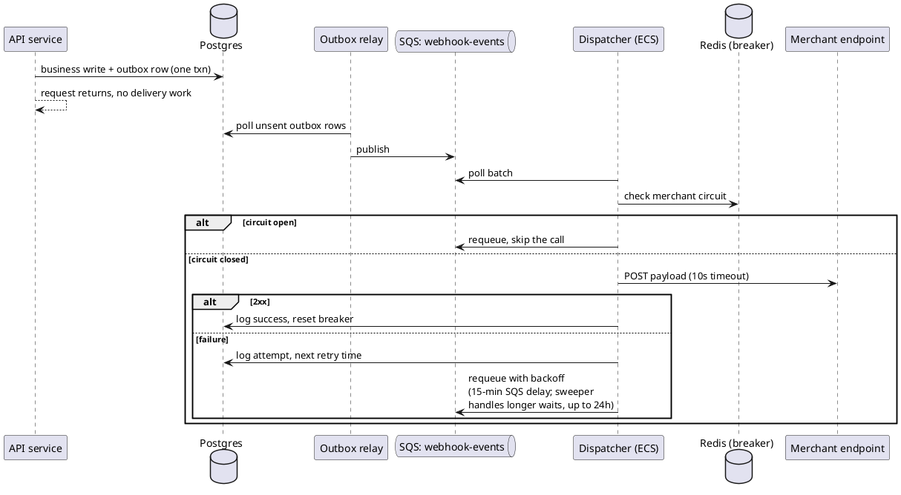

# Move webhook delivery to an outbox + SQS dispatcher

**Author:** platform team, **Status:** draft, **Sign-off:** platform lead, infra lead, **Reviewers:** API team, compliance

Take webhook delivery out of the API request path. Write events to an outbox table in the same transaction as the business write, relay them to SQS, and deliver from a separate dispatcher service with a per-merchant circuit breaker, retries over 24 hours, and a delivery log.

## Context and problem

Webhook delivery is synchronous today. After the API service commits a transaction, the same request thread POSTs the payload to every subscribed endpoint (`api/src/webhooks/dispatcher.py`), retrying 3 times with 1-second sleeps, then dropping the event with only a log line.

API latency depends on merchant endpoints being healthy. When a large merchant's endpoint degrades, request threads pile up in retry sleeps and API p99 goes from 180ms to 8s. On Black Friday this exhausted the thread pool and gave us 40 minutes of elevated 5xx on the public API (INC-4312).

We also lose data. 2.5% of deliveries exhaust retries and get dropped, about 100k events/day at the current 4M/day. Missed webhooks are our top support category at roughly 30% of tickets.

The design must handle 4M events/day (~46/sec average), observed peaks of 400/sec on Black Friday, and roughly 800/sec peak next year if volume doubles again. We already tried tuning the inline path in 2023 (retries from 1 to 3): delivery improved about 1% and the added sleeps caused INC-4312. Tuning it further won't get us to the goals.

## Goals

- At least 99.9% of events are delivered within 24 hours over a rolling 7-day window for active endpoints that return a 2xx response at least once during the event's delivery window.
- API latency independent of merchant endpoint behavior.
- No silent drops: every undeliverable event lands somewhere we can inspect.

## Non-goals

- Merchant-facing delivery log UI (next quarter; we write the log now).
- Guaranteed per-merchant ordering (product accepts best-effort, documented).
- Merchant-initiated replay (the delivery log makes it buildable later).
- Any change to the public API contract or subscription model.

## Constraints and assumptions

Constraints:

- 3 engineers, one quarter, alongside on-call.
- AWS only. Ops runs Postgres, Redis, ECS. No Kafka experience anywhere.
- Payloads contain PII: 30-day retention cap, nothing leaves the account.

Assumptions, each checkable:

- The 2.5% drop rate is mostly transient failures that a 24-hour retry window recovers. Permanently unavailable endpoints are outside the delivery-success denominator but still affect capacity and support load. Measure the failure mix from existing logs in week 1 before committing the target.
- Merchants can handle occasional duplicates once documented (at-least-once is standard; GitHub and Stripe both do it).
- Median payload fits SQS's 256KB limit. Not tracked today; open question #2.

## Options considered

For each option I looked at delivery reliability, impact on the API, ops load for this team, and effort within the quarter.

**A. Keep delivery in the API, make it more resilient** (async I/O, per-endpoint circuit breakers, no queue). This has the lowest implementation cost, and circuit breakers would likely have prevented INC-4312. Delivery would still stop with the API process, retries would still compete with request traffic, and failed events would have no durable destination. It reduces short-term risk but cannot reach 99.9%.

**B. Postgres-only queue.** Same outbox table, workers poll it with `SELECT ... FOR UPDATE SKIP LOCKED`, no SQS. Fewer moving parts, and at 46/sec average I'd pick it. But at 400/sec peaks with retries on top, the queue churn (dead tuples, vacuum pressure, hot indexes) lands on the same primary that serves the API. That trades thread coupling for database coupling.

**C. Outbox + SQS + dispatcher service (recommended).** The API writes each event to an outbox table in the business transaction. A relay publishes outbox rows to SQS. Dispatcher workers on ECS deliver, with a per-merchant circuit breaker in Redis and a delivery log in Postgres. Retries back off over 24 hours: SQS delay covers the first 15 minutes (its cap), a sweeper reschedules older retries from the delivery log. The first-attempt SQS request baseline is about $60-145/month depending on batching; retries, compute, and storage are additional. Tradeoffs: the most moving parts of the working options (outbox, relay, queue, workers, breaker), duplicates (documented), ordering best-effort (accepted).

**D. Kafka (MSK).** Provides replay, per-partition ordering, and capacity beyond the projected load. The team has no Kafka operating experience, and this quarter's requirements do not need capabilities that SQS lacks. Reconsider it if volume continues to double.

## Decision

Option C.

- Only B, C, and D decouple API latency from merchants. A fails that required goal.
- The outbox is not optional in any queue option: publish-after-commit is a dual write, and a crash between commit and publish silently loses the event, which is the bug we're fixing.
- The circuit breaker is what stops one slow merchant from soaking the worker pool and recreating INC-4312 inside the dispatcher.
- B moves the coupling into the database instead of removing it. D exceeds the team's current operating capacity. A cannot meet the latency goal.

## How it works

The diagram stays at one abstraction level: services and stores, without classes.

First-attempt SQS cost baseline: 4M events/day is about 120M/month. An unbatched model uses 3 requests per delivery (send, receive, delete): ~360M requests at $0.40/M, about **$145/month**. Batching receives and deletes in groups of 10 reduces the baseline to roughly 144M requests, or about $58/month. Retry traffic, two small ECS tasks, and storage are additional; retry cost cannot be estimated until the failure distribution is measured. The delivery log grows at 4M rows/day, about 120M rows/month: partition by day and drop partitions older than 30 days. Storage depends on payload size (open question #2); if payloads are large, they move to S3 with the same retention and the log keeps a reference.

## Cross-cutting concerns

- **Security/privacy.** PII now sits in the outbox, SQS (14-day max retention, account KMS key), and the delivery log. The log stores metadata plus a payload reference so retention exposure stays in one place. The dispatcher makes outbound calls to merchant URLs, so it gets egress restrictions and URL validation against private ranges; that exposure exists today, this just moves where the calls originate.
- **Observability.** Rolling 7-day delivery success within 24 hours for active endpoints that return a 2xx during the delivery window (per merchant and overall), outbox lag, open circuits, and events that exhaust the retry window. Track excluded unavailable endpoints separately so denominator changes stay visible.
- **Capacity.** Relay and dispatcher are stateless; scale on queue depth. 800/sec projected peak is well under SQS limits.

## Rollout and validation

- **Phase 1, weeks 1-4.** Outbox and delivery log tables (purge/partition job written with them, not after), relay, dispatcher, breaker. Shadow mode: publish to SQS while the inline path still delivers, compare delivery records.
- **Phase 2, weeks 5-8.** Cut merchants over by cohort, smallest first, inline path staying as a feature-flagged fallback. Rollback at any point is flipping merchants back.
- **Phase 3, weeks 9-12.** Full cutover, delete the inline dispatcher, document the duplicates and ordering behavior for merchants.

Success check: at least 99.9% of eligible events meet the 24-hour delivery target over 7 days, using the denominator defined in the goal, and API p99 stays flat while we deliberately slow a test merchant endpoint in staging.

## Risks and open questions

- **How much of the 2.5% is unavailable endpoints versus transient failures?** Determines retry capacity, support policy, and whether the 99.9% target is reachable for the defined eligible population. Measure from existing logs in week 1.
- **Payload size distribution is untracked.** Decides Postgres vs S3 for payload storage and whether the SQS 256KB cap bites. Add a size histogram to the current dispatcher in week 1.
- **The largest merchant's tolerance for redelivery bursts is unknown.** A backlog drain could overload the endpoint again. Confirm the limit before phase 2 and start with a conservative per-merchant rate.
- **Some merchants may not handle duplicates safely.** Document the behavior and provide an event ID header for idempotency. Use the cohort rollout to detect incompatibilities before broad cutover.
