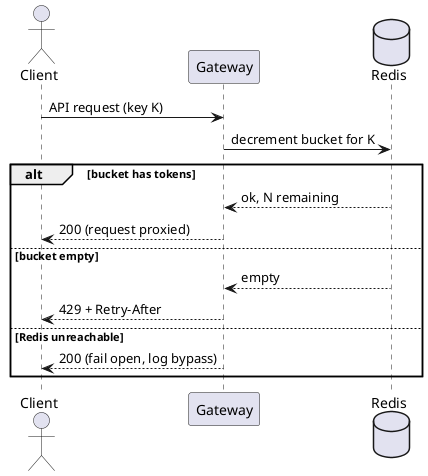

# Annotated example: a tech design

A short design document with notes explaining the choices. Use it as a quality reference, not a template. The `> NOTE:` blocks would not appear in the final document.

The example: a small team needs to add rate limiting to a public API.

---

## Rate limiting for the public API

*Author: J. Torres. Status: in review. Sign-off needed from: API platform, on-call lead.*

> NOTE: The metadata states whether the decision is still open and who must approve it.

**Summary.** Add per-key rate limiting to the public API to stop a handful of clients from degrading service for everyone. I recommend a token-bucket limiter in the existing gateway, backed by Redis.

> NOTE: The summary states the problem and recommendation before the supporting detail.

### Context and problem

The public API has no rate limiting. Last month two clients running tight retry loops drove 60% of total traffic for about three hours and pushed p99 latency from 120ms to 1.4s for everyone else. We got four support tickets and one escalation. Nothing in the system today stops a single key from consuming unbounded capacity.

> NOTE: Percentages, latency, and operational consequences establish the problem without generic background.

### Goals and non-goals

Goals:
- Cap how much traffic any single API key can send per second.
- Return a clear 429 with a Retry-After header when a client is over the limit.
- Keep added latency under 5ms at p99.

Non-goals:
- Per-endpoint or per-plan tiered limits. Useful later, out of scope now.
- Billing or quota enforcement. This is about protecting the service, not metering it.

> NOTE: The non-goals keep pricing tiers and other separate decisions out of this review.

### Constraints and assumptions

Constraints:
- The gateway is the only place every request already passes through. Limiting anywhere else means touching every service.
- We run three gateway instances behind a load balancer, so the limiter state has to be shared, not per-instance.

Assumptions:
- Traffic stays under roughly 5k requests/second in the near term. Redis handles this comfortably; if we were at 50k I would reconsider.

> NOTE: The document separates imposed constraints from testable assumptions and names the threshold that would invalidate the scale assumption.

### Options considered

**Option A: token bucket in the gateway, backed by Redis.** Each key gets a bucket refilled at a fixed rate. The gateway checks and decrements the bucket in Redis on each request. Shared state across instances, one extra network hop to Redis (~1ms in our setup).

Tradeoffs: adds a Redis dependency on the request path, so a Redis outage has to fail open or it takes the API down with it. Well-understood algorithm, easy to reason about.

**Option B: in-memory limiter per gateway instance.** No shared state, no Redis, near zero added latency. But with three instances a client effectively gets triple the limit, and the limit shifts as instances scale. Simpler to build, weaker guarantee.

**Option C: do nothing, ask clients to behave.** Document the expected limits and handle abuse case by case. Zero engineering cost. But it does not actually prevent the outage we already had, and it puts us back on support tickets.

> NOTE: Three credible options include "do nothing." Each names its downside, including the Redis dependency in the recommendation. Option B remains plausible on simplicity.

### Decision and rationale

I recommend Option A. The shared-state requirement is real: with three instances, Option B's limit is both too loose and unpredictable, which defeats the goal of protecting the service. The cost of A is the Redis dependency on the request path, and we can contain it by failing open: if Redis is unreachable, the gateway allows the request and logs it, so a limiter outage degrades to today's behavior rather than an outage. The ~1ms hop fits the 5ms budget.

> NOTE: The decision follows from the goals and shared-state constraint. It addresses the Redis request-path dependency directly.

### Request flow

> NOTE: The sequence diagram shows the request and fail-open paths at one abstraction level. PlantUML keeps it versionable and supports the target Confluence environment.

### Security, privacy, and observability

No new privacy surface: the limiter keys off the existing API key, no new personal data is stored. Security-relevant: the fail-open path is itself a risk (an attacker who can take down Redis removes the limit), so alerting on bypass volume matters as much as the limiter itself. Observability: bucket-empty count, bypass count, and per-key limiter latency all get added to the existing gateway dashboard.

> NOTE: The document states the privacy conclusion and the evidence behind it instead of leaving the concern implicit.

### Consequences

- We take on Redis as a request-path dependency and the operational care that implies: monitoring, a failover plan, and the fail-open path tested.
- "Fail open" means a Redis outage temporarily removes rate limiting. We accept that; it is no worse than today.
- Per-key limits are now a config surface someone has to own and tune.

> NOTE: The consequences include operational ownership and the loss of protection during a Redis outage, not only benefits.

### Implementation sketch

1. Add a Redis instance (or reuse the existing cache cluster, to be decided).
2. Add limiter middleware in the gateway: check-and-decrement, return 429 with Retry-After on empty bucket.
3. Fail-open path plus a metric for "limiter bypassed because Redis was down."
4. Roll out in shadow mode first (count would-be-blocked requests, block nothing), read the numbers for a week, then enforce.

> NOTE: The implementation outline establishes feasibility and includes a shadow-mode rollout before enforcement.

### Risks and open questions

- Reuse the existing cache cluster or stand up a dedicated Redis? Sharing risks the limiter and the cache taking each other down. Open.
- What is the right default limit? Shadow mode should tell us. Until then any number is a guess.

> NOTE: The open questions identify what the review must resolve. Shadow mode supplies evidence for the unset default limit.

---

## Why this works, in short

- A one-line metadata block says who wrote it, its status, and who must sign off.
- The problem is specific and appears before the solution.
- Three credible options include "do nothing," and the recommendation states its cost.
- The decision explains its reasoning and addresses the main objection.
- A versioned PlantUML diagram shows the request and fail-open paths for the target Confluence environment.
- Security, privacy, and observability are addressed explicitly.
- Costs and open questions are easy to find.
- Every section supports the decision, and the prose avoids canned or inflated language.
